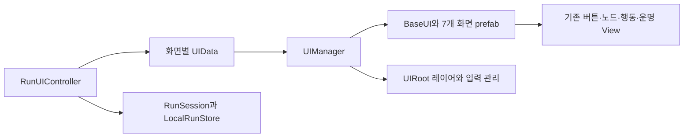

# UI_STRUCTURE_REPORT

상태: COMPLETE. 2026-09-08 사용자 승인 "UI 구조 개선부터 진행"을 구현했다. 대상 D:/UnityProject/Dice_Warrior, Unity6000.6.0f1, main433edddc872433ead6db52a872ea0fcac659d92e. 커밋/branch/staging은 하지 않았다.

화면 전체 배치는 이제 Unity Inspector/Prefab Mode에서 수정할 수 있다. UIRoot가 Canvas·SafeArea·화면/팝업/Overlay/캐시 영역을 갖고, UIManager가 타입별 화면 하나를 재사용한다. RunUIController가 게임·저장 명령과 표시 DTO를 소유하며 BaseUI<TData>와 각 화면은 바인딩/표시/소유 listener 정리를 맡는다. 이전 FateDiceScreen script GUID와 public 통합 진입점은 유지했다.

| 편집할 대상 | 실제 파일 / 역할 |
|---|---|
| Canvas·SafeArea·레이어·화면 등록 | Assets/_Project/Shared/UI/Prefabs/UIRoot.prefab의 UIRoot/UIManager |
| 메뉴 배치·고정 제목·Seed 입력 | Assets/_Project/Features/Run/Prefabs/MenuUI.prefab |
| 지도·운명 선택 배치 | 같은 폴더 ExplorationUI.prefab. Map→Roll→Cards는 같은 인스턴스로 노드 fade 유지 |
| 전투 배치 | 같은 폴더 CombatUI.prefab |
| 사건·휴식·상점 배치 | 같은 폴더 EncounterUI.prefab |
| 보상·장비/주사위 교체·결과 배치 | 같은 폴더 RewardUI.prefab, EquipmentUI.prefab, ResultUI.prefab |
| 개별 카드·버튼 원본 | 기존 Shared/UI/Prefabs/CommonButtonView 및 Exploration/Combat/Fate의 각 원본. 세 카드/노드 원본의 CommonButton Variant 관계 유지 |
| 콘텐츠별 그림·공개 유형·등급 표시 | 기존 Features/Run/Configs/DefaultFateDiceVisuals.asset. 게임 규칙 SO와 별개 |

화면 prefab의 RunScreenLayout 및 화면별 컴포넌트에 Text/Image/Input/Container 참조가 연결돼 있다. 고정 레이아웃·타이포그래피·제목을 수정하면 다음 Scene 실행/해당 인스턴스 생성부터 반영된다. 살아 있는 캐시 전체 화면의 자동 hot reload는 계약에 포함하지 않는다. 반복 버튼·카드는 다음 바인딩에서 원본을 다시 Instantiate하므로 해당 원본 스타일 변경을 반영한다. 본문은 ScrollRect로 스크롤한다.

새 화면은 BaseUI<TData> 또는 RunScreenView<TData> 파생 컴포넌트와 전체 prefab을 만들고 UIRoot의 UIManager.prefabs에 직접 등록한다. 표시 data와 사용자 선택 요청은 Controller에서 공급한다. SharedUI는 uGUI에만 의존하며 InputSystem은 기존 Runtime 및 prefab을 작성하는 Editor assembly에서 사용한다. Resources 문자열 경로, 전역 singleton, 새 UI 패키지를 추가하지 않았다.

수명·입력 계약: 최초 Bind 완료 후 활성화, 최초 Initialize1회, 같은 열린 화면 재Bind, 다른 화면은 Unbind/취소/입력 차단 후 캐시. 팝업은 명시적 stack이며 blocker는 최상위 popup 바로 아래, 하위 화면과 popup은 입력 차단. 닫으면 유효한 이전 focus를 복원한다. global Busy 잠금은 popup 열기/닫기로 풀리지 않는다. Escape는 top popup부터 닫고, popup이 없으면 메뉴로 돌아간다. 창 닫기가 게임 보상/진척을 실행하지 않는다.

| 검증 | 실제 결과 / 근거 |
|---|---|
| EditMode | 122/122 PASS, final-edit.json. 기존 규칙·확률·상태·저장·VisualCatalog 검사 |
| PlayMode | 37/37 PASS, final-play.json, 38.08초. 기존 GUI14+재사용View7+Manager13+구조3 |
| 실제 플레이 회귀 | 끝까지 진행/승리·패배/저장재개/재굴림/사건·상점/장비·주사위 선택/중복입력/비공개 그림/동일 offered IDs/합류 노드 fade 포함 |
| 새 구조 오라클 | 7개 authored 화면/root의 실제 자산·스크립트·고정 레이아웃; prefab padding/heading 수정→실제 Scene 반영→동일 cache 복귀→원본 bytes 복구; 전역 EventSystem top raycast의 modal/lock 차단 |
| 화면 확인 | menu.png, map-720x1280.png, map-720x1600.png, fates.png, combat.png. 수동 확인은 실제 overlay UI 캡처이며 포인터 회귀는 위 PlayMode 결과 |
| 자산·문서 | 41개 C#↔41개 CodeMap, 신규 meta 존재, INDEX 동기화. UIRoot+7screen registry/Scene 연결 및 MissingScript 검사 결과는 final-assets.json |
| 보호 범위 | 게임 기본 config/패키지 manifest·lock/프로젝트 설정/AGENTS hashes 유지. 기존4 UI원본·VisualCatalog 및 게임/저장 소스 bytes 유지 |

증거 폴더: C:/Users/coli4/OneDrive/문서/ChatGPT/Dice_Warrior/artifacts/ui-structure. 최초 코드 검토 보고서는 같은 Codex workspace의 evidence/ui-structure/initial-review.md. 초기 RED는 structure2개 missing asset, manager13개 NotImplementedException으로 확인했다. 중간 테스트 실행기가0건 반환한 경우는 PASS로 인정하지 않았고 설정 변경 없이 EditorUtility.RequestScriptReload로 새 도메인을 불러온 뒤 실제 실행 수를 확인했다.

최초 검토1/1, 수정 묶음1/2 사용. UI-STRUCT-01: footer80/grade row90이 CommonButton 최소102보다 작아 footer가 실제 하단6px 이탈했다. Editor API로 footer108/grade row112로 맞추고 row가 원본 높이를 수용하는 구조 oracle를 추가했다. 기존 실패 GUI4개 포함 full37 재검증PASS. 미해결 필수 Finding0. 이전 완료된 프로토타입 작업의 Finding/횟수는 변경하지 않았다.

현재 Scene은 FateDicePrototype.unity로 유지한다. Title/Lobby/InGame의 실제 Scene 분리, Addressables·일반화한 item pool·UI Toolkit 전환, 게임 밸런스/저장 스키마 변경은 이번 범위가 아니다. Android APK 재빌드와 실기기 검증은 NOT_RUN이며 기존 APK에 이번 UI 변경이 포함됐다고 주장하지 않는다.
